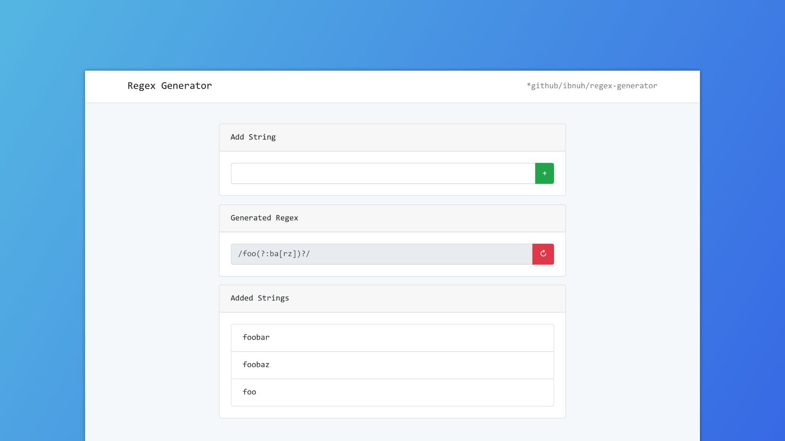

# Regex Generator
A web tools to generate regular expressions from set of strings.



## Web
https://ibnuhx.com/regex-generator

## Development
```
Clone the repository
```

```
npm install
```

```
npm run prod
```

## Credits
regexgen package by [devongovett/regexgen](https://github.com/devongovett/regexgen)

## License
MIT
