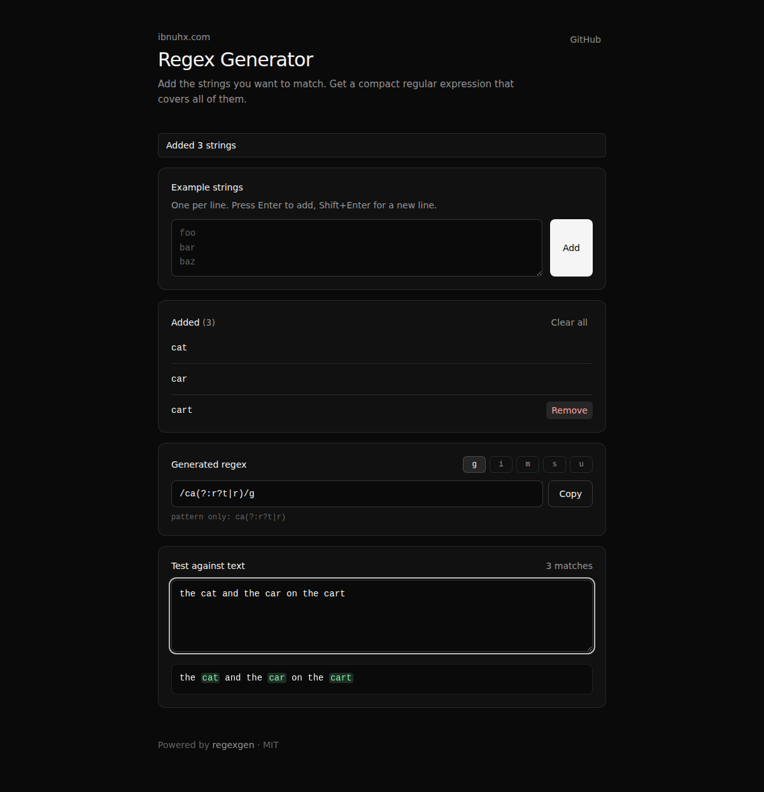

# Regex Generator

A small web tool that builds a regular expression from example strings.

**Live:** https://ibnuhx.com/regex-generator



## What it does

1. Add the strings you want to match (one per line).
2. Get a compact regex that covers all of them.
3. Toggle flags, copy the literal, and test it against sample text with live highlights.

The pattern engine is [regexgen](https://github.com/devongovett/regexgen) by Devon Govett.

## Development

```bash
npm install
npm run dev
```

```bash
npm test
npm run build
```

Production assets default to the `/regex-generator/` base path used on ibnuhx.com. For root hosting:

```bash
BASE_PATH=/ npm run build
```

## Stack

- Vue 3
- Vite 6
- Tailwind CSS 4
- Vitest

## License

MIT
